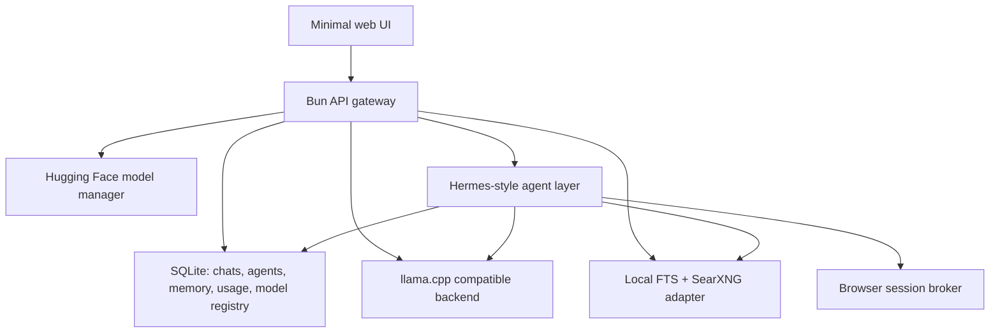

# Architecture

Nipux Local AI is a local control plane, not a monolithic model runtime.



## Design Rules

- No Docker requirement.
- Local-first by default.
- API-compatible with existing OpenAI clients where practical.
- UI exposes modes, not model internals: Fast, Balanced, Smart.
- Advanced model search/download lives in the Models view.
- Agents have persistent memory and run history from day one.
- Browser automation is a brokered capability, not unrestricted agent power.
- Image/video/audio remain future capability lanes; v0.1 is LLM-only.

## Main Processes

- `src/main.ts`: HTTP server, static UI, OpenAI-compatible routes, app API.
- `src/providers/llamaCpp.ts`: llama.cpp proxy and fake dev backend.
- `src/services/modelRegistry.ts`: Gemma presets and Hugging Face integration.
- `src/services/agents.ts`: agent runs, memory injection, search context.
- `src/services/search.ts`: local FTS and SearXNG.
- `src/services/hardware.ts`: OS/GPU/RAM detection.
- `src/db.ts`: SQLite schema and persistence helpers.

## Agent Memory

Each agent has:

- identity and model preset
- system prompt
- durable memory entries
- run history
- local/web search context per run
- browser session metadata

The first agent implementation is intentionally conservative. It stores task summaries and retrieves memories with local search. Later Hermes integration should wrap the same persistence tables instead of replacing them.

## Hermes Adapter

The app exposes Hermes readiness at:

```text
GET /api/hermes/status
```

That route checks whether `hermes` is installed and returns the commands needed to point Hermes at the local llama.cpp-compatible backend:

```bash
hermes config set model.provider custom
hermes config set model.base_url http://127.0.0.1:8080/v1
hermes config set model.default google/gemma-4-12B-it-qat-q4_0-gguf:Q4_0
```

When Hermes is unavailable, the app uses the built-in internal memory agent so agents still work out of the box. A future live Hermes runner should execute through this adapter and keep the same database memory tables as the product source of truth.

## Future Capability Ports

The API gateway should gain separate worker adapters for:

- `image.generate` with Ideogram or another local image backend
- `audio.transcribe` with whisper.cpp
- `audio.speech` with Kokoro/Piper
- `video.generate` with a queued, opt-in worker

Those should all emit usage events and job records through the same database path.
