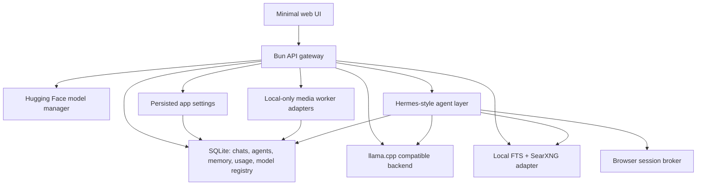

# Architecture

Nipux Local AI is a local control plane, not a monolithic model runtime.



## Design Rules

- No Docker requirement.
- Local-first by default.
- API-compatible with existing OpenAI clients where practical.
- UI exposes modes, not model internals: Fast, Balanced, Smart.
- Advanced model search/download lives in the Models view.
- Agents have persistent memory and run history from day one.
- Browser automation is a brokered capability, not unrestricted agent power.
- Image/video/audio use local-only worker adapters until bundled local runtimes are reliable.

## Main Processes

- `src/main.ts`: HTTP server, static UI, OpenAI-compatible routes, app API.
- `src/providers/llamaCpp.ts`: llama.cpp proxy and fake dev backend.
- `src/services/modelRegistry.ts`: Gemma presets and Hugging Face integration.
- `src/services/modelRuntime.ts`: app-managed llama.cpp start/stop/status/test path.
- `src/services/chats.ts`: persisted chat records and messages.
- `src/services/agents.ts`: agent runs, memory injection, search context.
- `src/services/browserAudit.ts`: browser action logs and permission requests.
- `src/services/memory.ts`: memory CRUD and scored token retrieval.
- `src/services/fileIndexer.ts`: safe local file/folder indexing into SQLite FTS.
- `src/services/browserBroker.ts`: Playwright browser sessions for agents and UI takeover.
- `src/services/search.ts`: local FTS and SearXNG.
- `src/services/settings.ts`: persisted runtime settings, env-derived boot defaults, and Settings status.
- `src/services/media.ts`: local-only image/audio/video capability checks, worker calls, and media job records.
- `src/services/mediaRuntimes.ts`: hardware-aware setup plan for local media worker contracts, default ports, env vars, and fit guidance.
- `src/services/localSpeech.ts`: built-in local speech fallback through OS speech commands.
- `src/services/readiness.ts`: user-facing readiness summary that combines setup checks, media runtimes, local chat, search, and API exposure.
- `src/services/launchProfile.ts`: machine-specific launch profile, env, and local launcher script generation.
- `src/services/hardware.ts`: OS/GPU/RAM detection.
- `src/db.ts`: SQLite schema and persistence helpers.

## Settings And Dev Mode

The Settings page writes user-facing defaults to SQLite. Environment variables still seed first-run values, but saved settings are read at runtime for:

- default Fast/Balanced/Smart mode
- SearXNG URL
- Playwright browser headless mode
- dev-control visibility
- local media worker URLs

Dev mode hides advanced tools from the main experience until enabled. Runtime start/stop/test controls, Hugging Face model search/download, file-path indexing, raw status JSON, and browser action logs are dev-only surfaces. Permission approvals remain visible because they are part of the agent safety flow.

The Setup page is the non-dev status surface. It calls `/api/readiness` and `/api/launch/profile`, then shows capability status, launch commands, and next steps without exposing raw diagnostics by default.

## Agent Memory

Each agent has:

- identity and model preset
- system prompt
- durable memory entries
- memory summaries, token counts, source metadata, and source ids
- run history
- local/web search context per run
- browser session metadata

The memory table keeps active and archived memories. Manual memories use `source=manual`; task memories created after an agent run use `source=agent_run` with the run id; compaction summaries use `source=compaction` with source memory ids retained. Compaction archives source task memories rather than deleting them, so the UI can stay simple while provenance remains inspectable.

The first agent implementation is intentionally conservative. It stores task summaries, lets users add/edit/delete durable memories, retrieves relevant memories with scored token retrieval, and compacts old task memories into summary memories. Later Hermes integration should wrap the same persistence tables instead of replacing them.

## Local Search

Manual text indexing and file/folder indexing share the same `local_documents` table and FTS index. File indexing uses:

- extension allow-list for text/code formats
- maximum file count
- maximum file size
- recursive scanning by default
- skipped dependency/build/cache directories
- idempotent path updates

This keeps local indexing useful without accidentally crawling huge build outputs or binary files.

## Chat Persistence

The OpenAI-compatible routes stay stateless for client compatibility. The web app uses native `/api/chats` routes to persist chat records and `/api/chats/:id/respond` for the app-native chat flow.

The native responder searches indexed local documents for the latest user message, injects relevant context into the model prompt, streams the assistant response, appends source lines, and persists the assistant message. This keeps normal chat useful with local files while preserving the plain `/v1/chat/completions` contract for API clients.

Assistant messages in the web chat can be played through `/v1/audio/speech`. That keeps voice playback on the same local speech path as API clients: configured loopback speech workers first, built-in system speech second.

Voice input records microphone audio in the browser and posts it to `/v1/audio/transcriptions` as multipart form data. The server converts that upload to the existing local worker JSON contract, so transcription remains local-only and fails honestly when no loopback transcription worker is configured.

This keeps external API behavior predictable while giving the UI normal chat-app behavior across reloads.

## API Exposure

The server binds to `127.0.0.1` by default. `NIPUX_PUBLIC_API=1` switches the default bind host to `0.0.0.0`, but protected routes are locked unless `NIPUX_API_KEY` or `NIPUX_API_KEYS` is configured.

Protected routes accept `Authorization: Bearer <key>` or `x-api-key: <key>`.

## Hermes Adapter

The app exposes Hermes readiness at:

```text
GET /api/hermes/status
```

That route checks whether `hermes` is installed and returns the commands needed to point Hermes at the local llama.cpp-compatible backend:

```bash
hermes config set model.provider custom
hermes config set model.base_url http://127.0.0.1:8080/v1
hermes config set model.default google/gemma-4-12B-it-qat-q4_0-gguf:Q4_0
```

When Hermes is unavailable, the app uses the built-in internal memory agent so agents still work out of the box. A future live Hermes runner should execute through this adapter and keep the same database memory tables as the product source of truth.

## Browser Broker

Browser sessions are persisted before Chromium starts. That keeps the UI fast and lets the app show planned/closed/error states even if the browser runtime is missing.

The broker currently supports:

- create/list sessions
- open/close a persistent Chromium context
- navigate
- screenshot
- click screenshot coordinates
- type text into the focused page
- press a key

Default mode is headless with UI screenshots. Users can switch this in Settings, or set `NIPUX_BROWSER_HEADLESS=0` as the first-run boot default when they want visible Chromium windows they can control directly outside the app.

Agent safety gates still need to be layered above these controls before autonomous browser actions are allowed for purchases, posts, credentials, downloads, uploads, or destructive local actions.

## Browser Permissions

Browser actions are recorded in `browser_action_events`. User-originated UI actions execute directly and are still logged. Agent-originated risky actions create pending `permission_requests` before execution:

- navigate
- click
- type
- key press

Low-risk actions such as open, screenshot, and close can run without approval. A later autonomous agent runner should call the same browser API with `actor: "agent"` so these gates remain the central safety boundary.

## Media Workers

The API gateway has separate local-only worker adapters for:

- `image.generate` through an OpenAI-compatible local image endpoint
- `audio.transcribe` through a local transcription endpoint such as whisper.cpp
- `audio.speech` through a local TTS endpoint such as Kokoro/Piper
- `video.generate` through a queued, opt-in local video worker

Worker URLs must be loopback HTTP(S) URLs. The app rejects remote media workers so it remains local-first and does not hide external API usage. Media requests emit usage events and persistent `media_jobs` records whether they complete, fail, or are missing a configured worker.

`GET /api/media/runtimes` exposes the setup plan that installers and the dev-only Media UI use. It does not install or call remote model providers; it maps each lane to a local worker contract so later bundled runtimes can be automated without changing the public app API. Configured loopback workers are health-checked and stay `offline` until a local process responds.

Speech is the first lane with a built-in local fallback. When no speech worker URL is configured, the app can synthesize speech through macOS `say`, Linux `espeak`, or Windows SAPI if present. Generated audio is still recorded as a normal `media_jobs` row with `worker_url = builtin://system-speech`.
