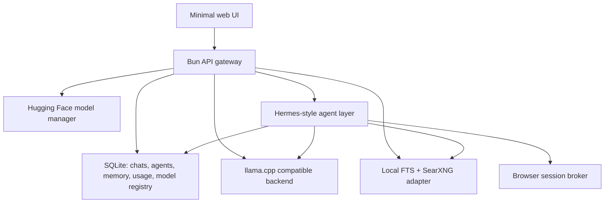

# Architecture

Nipux Local AI is a local control plane, not a monolithic model runtime.



## Design Rules

- No Docker requirement.
- Local-first by default.
- API-compatible with existing OpenAI clients where practical.
- UI exposes modes, not model internals: Fast, Balanced, Smart.
- Advanced model search/download lives in the Models view.
- Agents have persistent memory and run history from day one.
- Browser automation is a brokered capability, not unrestricted agent power.
- Image/video/audio remain future capability lanes; v0.1 is LLM-only.

## Main Processes

- `src/main.ts`: HTTP server, static UI, OpenAI-compatible routes, app API.
- `src/providers/llamaCpp.ts`: llama.cpp proxy and fake dev backend.
- `src/services/modelRegistry.ts`: Gemma presets and Hugging Face integration.
- `src/services/modelRuntime.ts`: app-managed llama.cpp start/stop/status/test path.
- `src/services/chats.ts`: persisted chat records and messages.
- `src/services/agents.ts`: agent runs, memory injection, search context.
- `src/services/memory.ts`: memory CRUD and scored token retrieval.
- `src/services/fileIndexer.ts`: safe local file/folder indexing into SQLite FTS.
- `src/services/browserBroker.ts`: Playwright browser sessions for agents and UI takeover.
- `src/services/search.ts`: local FTS and SearXNG.
- `src/services/hardware.ts`: OS/GPU/RAM detection.
- `src/db.ts`: SQLite schema and persistence helpers.

## Agent Memory

Each agent has:

- identity and model preset
- system prompt
- durable memory entries
- run history
- local/web search context per run
- browser session metadata

The first agent implementation is intentionally conservative. It stores task summaries, lets users add/edit/delete durable memories, and retrieves relevant memories with scored token retrieval. Later Hermes integration should wrap the same persistence tables instead of replacing them.

## Local Search

Manual text indexing and file/folder indexing share the same `local_documents` table and FTS index. File indexing uses:

- extension allow-list for text/code formats
- maximum file count
- maximum file size
- recursive scanning by default
- skipped dependency/build/cache directories
- idempotent path updates

This keeps local indexing useful without accidentally crawling huge build outputs or binary files.

## Chat Persistence

The OpenAI-compatible routes stay stateless for client compatibility. The web app uses native `/api/chats` routes to persist chat records and messages around the streaming `/v1/chat/completions` call.

This keeps external API behavior predictable while giving the UI normal chat-app behavior across reloads.

## API Exposure

The server binds to `127.0.0.1` by default. `NIPUX_PUBLIC_API=1` switches the default bind host to `0.0.0.0`, but protected routes are locked unless `NIPUX_API_KEY` or `NIPUX_API_KEYS` is configured.

Protected routes accept `Authorization: Bearer <key>` or `x-api-key: <key>`.

## Hermes Adapter

The app exposes Hermes readiness at:

```text
GET /api/hermes/status
```

That route checks whether `hermes` is installed and returns the commands needed to point Hermes at the local llama.cpp-compatible backend:

```bash
hermes config set model.provider custom
hermes config set model.base_url http://127.0.0.1:8080/v1
hermes config set model.default google/gemma-4-12B-it-qat-q4_0-gguf:Q4_0
```

When Hermes is unavailable, the app uses the built-in internal memory agent so agents still work out of the box. A future live Hermes runner should execute through this adapter and keep the same database memory tables as the product source of truth.

## Browser Broker

Browser sessions are persisted before Chromium starts. That keeps the UI fast and lets the app show planned/closed/error states even if the browser runtime is missing.

The broker currently supports:

- create/list sessions
- open/close a persistent Chromium context
- navigate
- screenshot
- click screenshot coordinates
- type text into the focused page
- press a key

Default mode is headless with UI screenshots. Set `NIPUX_BROWSER_HEADLESS=0` when the user wants visible Chromium windows they can control directly outside the app.

Agent safety gates still need to be layered above these controls before autonomous browser actions are allowed for purchases, posts, credentials, downloads, uploads, or destructive local actions.

## Future Capability Ports

The API gateway should gain separate worker adapters for:

- `image.generate` with Ideogram or another local image backend
- `audio.transcribe` with whisper.cpp
- `audio.speech` with Kokoro/Piper
- `video.generate` with a queued, opt-in worker

Those should all emit usage events and job records through the same database path.
